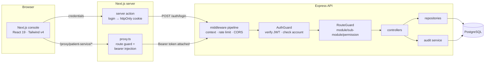
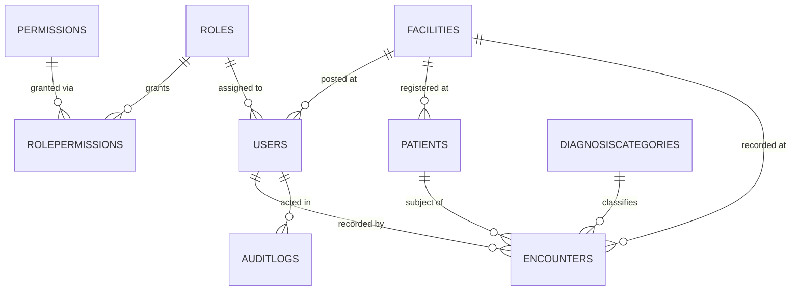

# Sanjeevani — Rural Health Outreach Console

A secure, role-based platform for rural telemedicine outreach: clinicians record
anonymised patient encounters at the point of care, and district administrators
analyse health trends across facilities — without either ever seeing a patient
identifier.

Built as a submission for the **HealthTech Patient Data Dashboard** assignment.

### Live

| | |
|---|---|
| **Console** | <https://sanjeevani-console-theta.vercel.app> |
| **API health** | <https://sanjeevani-patient-service.vercel.app/patient-service/health-check> |
| **Source** | <https://github.com/Swaralipatil-22/Sanjeevani_healthtech> |

Sign in with any of the [demo accounts](#demo-accounts) below — password
`Sanjeevani@123`. Signing in as each of the three roles in turn is the quickest
way to see the access model working.

| | |
|---|---|
| **API** | Node.js 20+ · Express 5 · TypeScript (ESM) · Sequelize 6 · PostgreSQL |
| **Console** | Next.js 16 (App Router) · React 19 · TypeScript · Tailwind CSS v4 · ApexCharts |
| **Auth** | JWT with AES-encrypted claims, stored in an httpOnly cookie |
| **Tests** | Vitest — 39 unit tests, 21 API integration tests |

---

## Contents

- [What it does](#what-it-does)
- [Repository layout](#repository-layout)
- [Running it locally](#running-it-locally)
- [Demo accounts](#demo-accounts)
- [Architecture](#architecture)
- [Data model](#data-model)
- [Access control](#access-control)
- [API reference](#api-reference)
- [Testing](#testing)
- [Deployment](#deployment)
- [Design decisions & trade-offs](#design-decisions--trade-offs)
- [Known limitations](#known-limitations)

---

## What it does

**For clinicians (doctors and nurses)**

- Register patients against a system-issued anonymised code — the database
  holds no name, phone number, address or government identifier
- Record encounters through a three-step form: visit details → clinical
  assessment and vitals → follow-up and review
- Browse, filter, sort and export their encounter history

**For district administrators**

- A dashboard of encounter volume, acuity mix, diagnosis categories, age
  distribution and per-facility load over any date range
- A notifiable-disease count, surfaced separately for statutory reporting
- An append-only audit trail of every sign-in, clinical change, export and
  denied request

**Role separation is the point of the system.** A doctor reads and writes all
clinical data but cannot open the dashboard. A nurse sees only the encounters
they personally recorded. An administrator analyses trends and manages users
but holds no clinical write permission at all.

---

## Repository layout

```
Sanjeevani/
├── sanjeevani-patient-service/     # Express API
│   ├── src/
│   │   ├── components/
│   │   │   ├── cache/              # TTL cache for permission lookups
│   │   │   ├── database/           # DBManager, 9 Sequelize models, seeder
│   │   │   └── repositories/       # Typed data-access layer
│   │   ├── controllers/            # One folder per domain
│   │   ├── global/
│   │   │   ├── middlewares/        # AuthGuard, RouteGuard, error handlers
│   │   │   └── validations/        # Yup schemas + custom validators
│   │   ├── routes/v1/              # Versioned route mounting
│   │   ├── services/audit/         # Audit trail writer
│   │   ├── logger/                 # Pino, ECS format, redaction
│   │   └── utils/                  # jwt, crypto, errors, exports, paging
│   └── tests/                      # Vitest unit + integration suites
│
├── sanjeevani-console/             # Next.js console
│   ├── src/
│   │   ├── app/
│   │   │   ├── (public)/auth/      # Login, logout
│   │   │   ├── (private)/          # Dashboard, patients, encounters, admin
│   │   │   └── actions/            # Server actions (cookie-writing login)
│   │   ├── components/
│   │   │   ├── ui/                 # Design-system primitives
│   │   │   ├── common/             # Toolbar, DataTable, stepper, charts
│   │   │   └── <domain>/           # Feature components
│   │   ├── constants/              # Routes, enums, chips, chart palettes
│   │   ├── lib/apis/client/        # One axios module per domain
│   │   ├── lib/permissions/        # PermissionGate + hooks
│   │   ├── store/                  # Redux Toolkit
│   │   ├── styles/global.css       # OKLCH design tokens
│   │   └── proxy.ts                # Route guard + bearer-token injection
│   └── Dockerfile
│
├── docs/
│   ├── ARCHITECTURE.md
│   ├── API.md
│   ├── USER-GUIDE.md
│   ├── DEPLOYMENT.md
│   └── SELF-ASSESSMENT.md
├── docker-compose.yml
└── render.yaml
```

---

## Running it locally

### Prerequisites

- Node.js 20 or newer
- A PostgreSQL 14+ database (see the three options below)

### 1. Get a database

**Option A — Docker (simplest if Docker Desktop is healthy)**

```bash
docker compose up -d postgres
```

**Option B — a free cloud Postgres (Neon, Supabase, Railway)**

Create a project, copy the connection details, and use them in step 2. Set
`DB_SSL=true`.

**Option C — a local PostgreSQL install**

Create a database and user both named `sanjeevani`.

### 2. Start the API

```bash
cd sanjeevani-patient-service
cp .env.sample .env          # then edit DB_* to match your database
npm install
npm run start:dev
```

On first boot the service creates its own schema and seeds master data, six
users, 120 patients and roughly 400 encounters spread over the last six months
— so the dashboard has something real to show immediately.

The API listens on <http://localhost:8000/patient-service>.
Health check: <http://localhost:8000/patient-service/health-check>

### 3. Start the console

```bash
cd sanjeevani-console
cp .env.sample .env.local    # defaults are correct for local development
npm install
npm run dev
```

Open <http://localhost:3000>.

---

## Demo accounts

All three share the password `Sanjeevani@123` (configurable via
`SEED_DEFAULT_PASSWORD`).

| Role | Email | What they can do |
|---|---|---|
| Doctor | `doctor@sanjeevani.health` | Read and write all patients and encounters |
| Nurse | `nurse@sanjeevani.health` | Create and see **only their own** records |
| Administrator | `admin@sanjeevani.health` | Dashboard, audit trail, users — no clinical write |

Signing in as each of the three is the fastest way to see the access model
working: the sidebar itself changes shape per role.

For how the application is actually used — registering a patient, recording an
encounter, reading the dashboard — see [docs/USER-GUIDE.md](docs/USER-GUIDE.md).

---

## Architecture



The browser never holds the JWT and never talks to the API directly. It calls
`/proxy/*` on its own origin; `proxy.ts` reads the httpOnly cookie server-side
and attaches the `Authorization` header. A cross-site script therefore has no
token to steal.

Full detail, including the request lifecycle and the reasoning behind each
layer, is in [docs/ARCHITECTURE.md](docs/ARCHITECTURE.md).

---

## Data model



Every table uses a readable string primary key of the form
`PREFIX-YYYYMMDD-aBcD123`, so support staff can identify a record's type and
creation date from the identifier alone.

Clinical tables are `paranoid` (soft-deleted) and carry `created_by`,
`updated_by` and `deleted_by`. `auditlogs` is the deliberate exception: it is
append-only, with no update path anywhere in the service.

**Patients hold no direct identifiers by design** — only `patient_code`, age,
gender, district, state, facility, chronic conditions and a pregnancy flag.

---

## Access control

Authorisation is expressed as `MODULE : SUB_MODULE : PERMISSION`, where
permission is one of `READ_ALL`, `READ_OWNED`, `WRITE_ALL`, `WRITE_OWNED`.

| Capability | Doctor | Nurse | Admin |
|---|:--:|:--:|:--:|
| Create / edit encounters | all | own only | — |
| View encounters | all | own only | all (read-only) |
| Register / edit patients | all | own only | — |
| View patients | all | own only | all (read-only) |
| Analytics dashboard | — | — | ✓ |
| Audit trail | — | — | ✓ |
| User administration | — | — | ✓ |

Enforcement happens in two places that mirror each other:

- **Server** — `RouteGuard` declares which permissions satisfy a route and
  records which the caller holds on `request.permissions_claimed`. Controllers
  read that: `READ_ALL` sees everything, `READ_OWNED` gets an ownership filter
  applied to the query.
- **Client** — `<PermissionGate>` hides controls and swaps whole pages for a
  403 panel, and the sidebar drops categories the user cannot reach.

The client checks exist purely so the UI does not offer actions that would be
refused. **Every decision is enforced server-side**; the console is never
trusted.

A denied request is itself an audit event, so an administrator can see who
attempted what.

---

## API reference

Base URL: `/patient-service/api/v1`

Following the convention of the platform this was modelled on, list, export,
update and delete are `POST`; only single-entity fetches are `GET`.

| Method | Path | Auth | Permission |
|---|---|---|---|
| POST | `/auth/login` | — | — |
| POST | `/auth/logout` | ✓ | — |
| GET | `/auth/profile` | ✓ | — |
| POST | `/auth/change-password` | ✓ | — |
| GET | `/masters/facilities` | ✓ | — |
| GET | `/masters/diagnosis-categories` | ✓ | — |
| GET | `/masters/clinicians` | ✓ | — |
| POST | `/patients/list` | ✓ | PATIENTS `READ_*` |
| POST | `/patients/export` | ✓ | PATIENTS `READ_*` |
| GET | `/patients/:id` | ✓ | PATIENTS `READ_*` |
| POST | `/patients` | ✓ | PATIENTS `WRITE_*` |
| POST | `/patients/update/:id` | ✓ | PATIENTS `WRITE_*` |
| POST | `/patients/delete/:id` | ✓ | PATIENTS `WRITE_*` |
| POST | `/encounters/list` | ✓ | ENCOUNTERS `READ_*` |
| POST | `/encounters/export` | ✓ | ENCOUNTERS `READ_*` |
| GET | `/encounters/:id` | ✓ | ENCOUNTERS `READ_*` |
| POST | `/encounters` | ✓ | ENCOUNTERS `WRITE_*` |
| POST | `/encounters/update/:id` | ✓ | ENCOUNTERS `WRITE_*` |
| POST | `/encounters/delete/:id` | ✓ | ENCOUNTERS `WRITE_*` |
| GET | `/analytics/overview` | ✓ | DASHBOARD `READ_ALL` |
| GET | `/analytics/trends` | ✓ | DASHBOARD `READ_ALL` |
| GET | `/analytics/distribution` | ✓ | DASHBOARD `READ_ALL` |
| POST | `/audit-logs/list` | ✓ | AUDIT_LOGS `READ_ALL` |
| POST | `/audit-logs/export` | ✓ | AUDIT_LOGS `READ_ALL` |
| POST | `/users/list` | ✓ | USERS `READ_ALL` |
| GET | `/users/:id` | ✓ | USERS `READ_ALL` |
| POST | `/users` | ✓ | USERS `WRITE_ALL` |
| POST | `/users/update/:id` | ✓ | USERS `WRITE_ALL` |

Every response uses one envelope:

```jsonc
{
  "success": true,
  "status_code": 200,
  "request_id": "0194f2c1-...",       // correlates logs, responses and audit rows
  "request_timestamp": "2026-09-10T17:42:01.114Z",
  "data": { "data": [ /* rows */ ], "count": 412 }
}
```

Errors keep the same shape with `success: false` and
`data: { detail, errors?, code? }`, so the console reads every message from one
place.

Request/response examples are in [docs/API.md](docs/API.md).

---

## Testing

```bash
cd sanjeevani-patient-service
npm test              # unit suite; integration tests skip without a database
npm run test:coverage
```

**Unit tests (39)** cover the parts where a mistake is silent and costly:

- authorisation — every role against every module, including cross-module leaks
- session tokens — round-trip, tampering, expiry, wrong audience, and that a
  decoded-but-unverified token leaks no clinician data
- validation — future-dated encounters, impossible vitals, follow-up before the
  visit, out-of-range ages, and that `clinician_id` is stripped from payloads
- pagination and sorting — offset maths, hostile page numbers, page-size caps,
  and rejection of sorts on non-allowlisted columns
- error normalisation — that a `detail` string always reaches the console

**Integration tests (21)** run the real Express app against a real PostgreSQL.
They cover login (including that wrong-password and unknown-account return
identical messages), RBAC denials per role, nurse ownership scoping, the full
encounter lifecycle, and the refusal to delete a patient who has history.

They are skipped automatically when no database is reachable, so `npm test`
stays green on a fresh machine. With a database configured, all 60 run.

---

## Deployment

Both services are containerised and deploy-ready. The short version:

- **Database** — Neon, Supabase or Render PostgreSQL (free tiers all work)
- **API** — Render or Railway from `sanjeevani-patient-service/Dockerfile`;
  `render.yaml` provisions the database and API together
- **Console** — Vercel, root directory `sanjeevani-console`, with
  `PATIENT_SERVICE_INTERNAL_ENDPOINT` pointing at the deployed API

Step-by-step instructions, including the env vars each platform needs and the
CORS setting that catches people out, are in
[docs/DEPLOYMENT.md](docs/DEPLOYMENT.md).

---

## Design decisions & trade-offs

**Pseudonymisation instead of encryption.** The strongest privacy guarantee is
not holding the data. Patients are stored with no name, contact number or
government identifier, so a full database compromise still yields no way to
identify a person. The trade-off is real: a clinician cannot search for a
patient by name, and the outreach worker has to carry the code. For a system
whose analytics are all aggregate, that is the right side of the trade.

**The JWT never reaches client JavaScript.** Login is a server action that
writes an httpOnly, `sameSite=strict` cookie; `proxy.ts` attaches the bearer
token server-side on the way through. This costs an extra network hop through
the Next.js server, and buys immunity to token theft via XSS.

**`READ_OWNED` as a first-class permission.** Rather than hard-coding "nurses
see less", ownership is a property of the permission itself. Controllers ask
whether the caller holds `READ_ALL`; if not, an ownership predicate is added to
the query. Adding a new scoped role is a seed change, not a code change.

**Ownership violations return 404, not 403.** A 403 confirms the record exists.
For clinical data that is itself a disclosure, so unauthorised lookups are
indistinguishable from missing ones.

**One shared query builder per resource.** The codebase this was modelled on
had a documented recurring bug where filter logic was duplicated between `list`
and `export` and the two drifted apart. Here both call
`buildEncounterWhere` / `buildPatientWhere`, so a filter fix cannot land in one
and miss the other.

**Aggregates are raw SQL; everything else is the ORM.** Dashboard queries use
`COUNT(*) FILTER (WHERE …)` and `DATE_TRUNC`, which Sequelize expresses poorly.
All values are bound as replacements, never interpolated, and `granularity` is
allow-listed by the request schema before it reaches the one interpolated spot.

**`sync({ alter: true })` rather than migrations.** This service owns its
schema outright and has no second writer, so schema sync at boot is the
appropriate simplicity. A shared database — or a second deployment of this
service — would need versioned migrations instead.

**Chart colour is computed, not chosen.** Three separate palettes do three
separate jobs: a single brand teal for single-series magnitude, a fixed
eight-slot categorical palette for diagnosis identity, and a reserved status
palette for clinical acuity. The categorical palette was validated for
colour-vision-deficiency separation against both the light and dark card
surfaces (worst adjacent CVD ΔE 9.1 light / 8.4 dark). Three light-mode slots
fall below 3:1 contrast, which is why that chart carries direct value labels.
Severity is always encoded twice — a dot *and* a word — so no clinical meaning
rests on colour alone.

---

## Known limitations

Honest list of what I would do next, roughly in priority order:

1. **Refresh tokens.** Sessions last three hours and then require a fresh
   sign-in. A refresh-token rotation flow would remove that interruption
   mid-consultation.
2. **Real-time updates.** The console refetches on mutation and on demand.
   The assignment allows either; a WebSocket or SSE channel would let a second
   clinician see a colleague's entry appear without refreshing.
3. **Offline-first data entry.** This matters more than anything else on this
   list for the actual use case — rural outreach units frequently have no
   connectivity. A service worker with an IndexedDB queue and conflict
   resolution on reconnect is the correct design.
4. **Versioned migrations**, once more than one service touches the database.
5. **Field-level encryption** for the free-text clinical notes, which are the
   one place a clinician might inadvertently type an identifying detail.
6. **Redis-backed permission cache**, so a role change invalidates across all
   replicas rather than within one process.
7. **Rate limiting per account** on the login endpoint specifically, in
   addition to the current global limiter.
8. **E2E tests** with Playwright covering the three role journeys — the current
   integration tests hit the API directly, not the browser.

A fuller write-up of what worked, what did not, and what I would change is in
[docs/SELF-ASSESSMENT.md](docs/SELF-ASSESSMENT.md).
