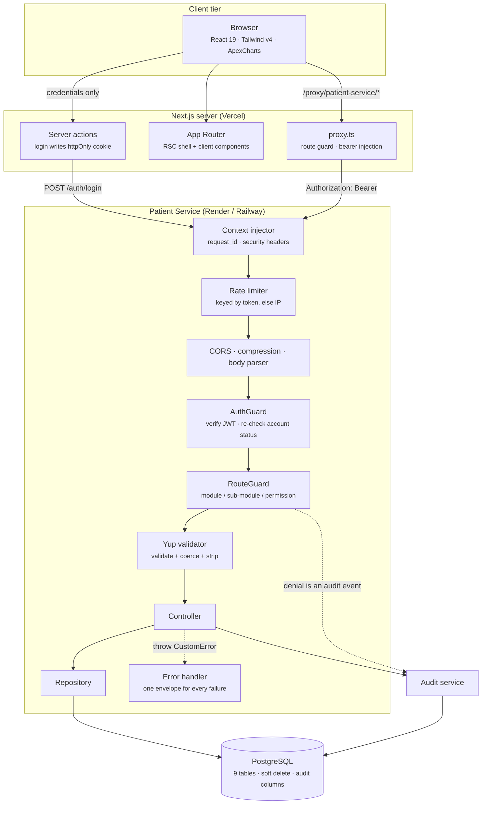

# Architecture

## System overview



## Why the browser never holds the token

The obvious design puts the JWT in `localStorage` and attaches it with an axios
interceptor. That design loses the token to any successful XSS.

Instead:

1. The login form calls a **server action**, not the API. Credentials go to the
   Next.js server, which forwards them to the patient service.
2. On success the server action writes the token into an **httpOnly,
   `secure`, `sameSite=strict` cookie**, expiring one minute before the JWT
   itself so the UI never sends a token the API is about to reject.
3. Every subsequent API call goes to `/proxy/patient-service/*` on the console's
   own origin. `proxy.ts` reads the cookie server-side, sets the
   `Authorization` header, and forwards to the API.

Client JavaScript therefore has no access to the token at any point. The cost
is one extra hop through the Next.js server; the benefit is that token theft
via XSS is structurally impossible rather than merely unlikely.

`proxy.ts` does double duty as the route guard: it decodes the JWT's `exp`
claim, and on an expired or missing session redirects to login, stashing the
attempted path in a short-lived `requested_destiny` cookie so the user lands
where they were going.

## Request lifecycle

Every request passes through the same ordered pipeline:

| # | Stage | Responsibility |
|---|---|---|
| 1 | HTTP logger | Pino, ECS format, auth headers and passwords redacted |
| 2 | Context injector | UUID v7 `request_id`, ISO timestamp, security headers |
| 3 | Response injector | Adds `res.customResponse()` so every handler replies in one shape |
| 4 | Hostname validator | Rejects unexpected `Host` headers |
| 5 | Rate limiter | Keyed by token so one clinic behind NAT cannot throttle itself |
| 6 | CORS | Origin allow-list; exposes `Content-Disposition` for exports |
| 7 | Body parser | JSON and urlencoded, 5 MB cap |
| 8 | **AuthGuard** | Verifies the JWT, then re-reads the account — a token stays cryptographically valid after an account is disabled, so status is checked per request, not trusted from the claim |
| 9 | **RouteGuard** | Matches the caller's grants against the route's acceptable permissions; records the matches on `request.permissions_claimed` |
| 10 | **Validator** | Yup schema validates, coerces and strips unknown keys, then *replaces* the request segment so controllers never see raw wire values |
| 11 | Controller | Business logic; delegates all queries to a repository |
| 12 | Error handler | Normalises anything thrown into the standard envelope |

Stages 8–10 are the security boundary. Nothing downstream re-checks identity,
authorisation or input shape, because nothing downstream can be reached without
passing them.

## The ownership model

The interesting part of the authorisation design is that "a nurse sees less" is
not special-cased anywhere. It falls out of the permission itself.

Permissions are `READ_ALL` / `READ_OWNED` / `WRITE_ALL` / `WRITE_OWNED` scoped
to a module and sub-module. `RouteGuard` accepts either variant and records
which one the caller actually holds:

```ts
router.post("/list", RouteGuard(PATIENT_MANAGEMENT, ENCOUNTERS_MANAGEMENT,
  [PERMISSIONS.READ_ALL, PERMISSIONS.READ_OWNED]), listEncounters);
```

The controller then reads that decision:

```ts
if (!hasFullAccess(request, PERMISSIONS.READ_ALL)) {
  where.clinician_id = request.decoded_user!.id;
}
```

Consequences worth noting:

- **The predicate is applied inside the query, not after it.** Pagination
  counts, exports and aggregates are all correct for the caller's scope,
  because the database never returns rows they may not see.
- **Single-entity lookups fold the same predicate into the `WHERE`.** An
  unauthorised fetch returns 404, not 403 — a 403 would confirm the record
  exists, which for clinical data is itself a disclosure.
- **Adding a scoped role is a seed change, not a code change.**

## Data integrity choices

**Readable primary keys.** `ENCOUNTER-20260910-aBcD123`. A support engineer
reading a log line knows the record type and creation date without a query.
Generated in a `beforeValidate` hook so no caller can supply one.

**Soft deletes with attribution.** Clinical tables are `paranoid` and carry
`created_by`, `updated_by`, `deleted_by`. `deleted_by` is written *before* the
destroy so the attribution survives.

**The audit log is append-only.** No `updated_at`, no soft delete, no update
path anywhere in the service. An audit row that can be edited is not an audit
row. Writes are fire-and-forget: an audit failure is logged but never fails
the clinical operation that triggered it.

**Referential safety over cascades.** `created_by` and friends are plain string
columns rather than foreign keys, so deactivating a clinician can never cascade
into clinical history. A patient with recorded encounters cannot be deleted at
all — the API returns 409.

## Analytics

Three endpoints back the dashboard:

- `/analytics/overview` — headline counts plus the equivalent figures for the
  immediately preceding window of the same length, which is what makes the
  period-on-period deltas possible
- `/analytics/trends` — `DATE_TRUNC` buckets at day/week/month granularity
- `/analytics/distribution` — six groupings (category, severity, gender, age
  band, facility, status) issued concurrently with `Promise.all`

These use raw SQL because `COUNT(*) FILTER (WHERE …)` and `DATE_TRUNC` are
awkward through the ORM. Every value is bound as a replacement. The single
interpolated value, `granularity`, is constrained to `day | week | month` by
the request schema before it reaches the query.

The dashboard returns aggregates only. No endpoint on this path can return a
patient row.

## Frontend structure

```
app/(public)/auth/…     unauthenticated routes
app/(private)/…         everything behind the session, wrapped by SessionProvider
app/actions/            server actions ("use server")
components/ui/          design-system primitives
components/common/      GlobalToolbar, DataTable, Stepper, chart shells
components/<domain>/    feature components
constants/              routes, enums, chip classes, chart palettes
lib/apis/client/        one axios module per domain
lib/permissions/        PermissionGate + hooks
store/                  Redux Toolkit (profile + master data)
```

`SessionProvider` fetches the profile, permissions and master data once before
the shell renders, so every downstream permission check is synchronous and the
UI never flickers between states.

Listing pages follow one invariant composition: `GlobalToolbar` → optional
filter panel → `DataTable` → confirmation dialog, all wrapped in a
`PermissionGate` whose fallback is the 403 panel.

## Design system

Tokens are declared in OKLCH in `styles/global.css` — light values on bare
`:root`, dark values redefined under both `prefers-color-scheme` and
`[data-theme="dark"]` so an explicit toggle wins in both directions.

Charts cannot read CSS custom properties from canvas, so
`constants/global/charts.ts` holds literal hexes resolved from the same ladder,
split by the job each colour does:

| Palette | Job | Rule |
|---|---|---|
| `SERIES_COLOR` | single-series magnitude | one brand teal, never varied |
| `CATEGORICAL_COLORS` | diagnosis identity | fixed 8-slot order, never cycled; ninth category folds into "Other" |
| `SEVERITY_COLORS` | clinical acuity | reserved; never reused as a series colour |

The categorical palette was validated for colour-vision-deficiency separation
against both card surfaces: worst adjacent CVD ΔE 9.1 light / 8.4 dark, worst
adjacent normal-vision ΔE 19.6 / 19.3. Three light-mode slots sit below 3:1
contrast, so the chart that uses them carries direct value labels.

Severity is encoded twice everywhere it appears — a coloured dot *and* the
written word — so no clinical meaning depends on colour perception.

## Scaling path

What holds today at outreach-clinic volumes, and what changes first:

| Concern | Now | At scale |
|---|---|---|
| Permission lookup | in-process TTL cache | Redis, so role changes invalidate across replicas |
| Schema | `sync({ alter: true })` at boot | versioned migrations |
| Sessions | 3-hour JWT | refresh-token rotation |
| Analytics | live aggregate queries | materialised views refreshed on a schedule |
| Exports | synchronous response | background job with a signed download URL |
| API instances | single container | horizontal; the service is already stateless |
